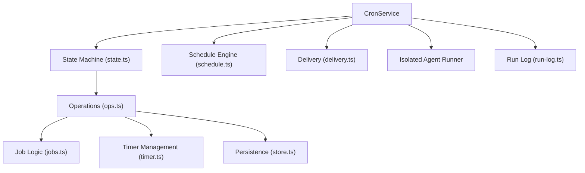
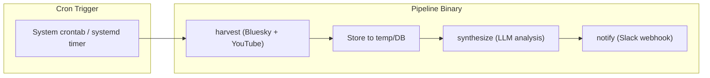

# OpenClaw Automation Architecture & Go Pipeline Design

## OpenClaw's Automation Stack

OpenClaw has a **three-layer** automation architecture. Each layer serves a different scheduling need:

### 1. Heartbeat — Batched Periodic Awareness

A recurring timer (default 30min) that runs in the **main session** with full context. Designed for batching multiple lightweight checks into one agent turn.

```
┌──────────────────────────────────────────────┐
│  HEARTBEAT.md (checklist)                    │
│  - Check inbox for urgent messages           │
│  - Review calendar for events in next 2h     │
│  - If background task finished, summarize    │
└──────────────────────────────────────────────┘
          ↓ (every 30min)
    Agent processes all items in one turn
          ↓
    HEARTBEAT_OK (nothing to report) or Message delivered
```

**Best for**: Multiple periodic checks, context-aware decisions, low-overhead monitoring.

### 2. Cron — Precise Scheduled Jobs

The core scheduler. Runs **inside the Gateway process**, persists jobs as JSON, supports exact timing via cron expressions, with isolated or main-session execution.

#### Architecture (from source code)



**Key design patterns from the source:**

| Pattern | Implementation | Purpose |
|---|---|---|
| State machine | `CronServiceState` struct with `store`, `timer`, `running`, `op` fields | Central coordination |
| Dependency injection | `CronServiceDeps` interface with callbacks for side effects | Testability, decoupling |
| Serialized operations | `locked()` wrapper ensures one mutation at a time | Concurrency safety |
| Atomic persistence | Write to `.tmp` file, `rename()` into place, `.bak` copy | Crash safety |
| Timer rearm | After every mutation: `recomputeNextRuns()` → `persist()` → `armTimer()` | Correct scheduling |
| Exponential backoff | 30s → 1m → 5m → 15m → 60m after consecutive errors | Resilience |

**Schedule types:**
- `at` — one-shot timestamp (ISO 8601)
- `every` — fixed interval in milliseconds
- `cron` — 5-field cron expression with IANA timezone (uses `croner` library)

**Execution modes:**
- **Main session**: Enqueues a system event into the heartbeat cycle
- **Isolated session**: Runs a dedicated agent turn in `cron:<jobId>` with a fresh session

**Persistence**: Jobs stored as `~/.openclaw/cron/jobs.json`. Run history as JSONL in `~/.openclaw/cron/runs/<jobId>.jsonl`.

### 3. Hooks & Webhooks — Event-Driven

- **Hooks**: TypeScript handlers that fire on internal events (`command:new`, `gateway:startup`, etc.)
- **Webhooks**: HTTP endpoints (`/hooks/wake`, `/hooks/agent`) for external triggers
- **Lobster**: Workflow runtime for multi-step tool pipelines with approval gates

---

## Recommended Architecture for Your Go Pipeline

Based on OpenClaw's patterns and your specific requirements, here's my recommended design. I'm **not** suggesting you replicate OpenClaw's full cron service — that's overkill for your use case. Instead, I recommend leveraging what Go excels at.

### Overview



### Option Comparison

| Approach | Pros | Cons | Verdict |
|---|---|---|---|
| **System crontab + CLI** | Zero daemon code, battle-tested, debuggable | No built-in retry, logs via syslog | ✅ **Recommended** |
| **systemd timer** | Retry, logging, service dependency | Linux-only, more config | ✅ Great alternative |
| **In-process scheduler** (like OpenClaw) | Full control, custom logic | Must run as daemon, complexity | ❌ Overkill |
| **Go cron library** (`robfig/cron`) | Familiar cron syntax in Go | Must run as long-lived process | ⚠️ Only if you need a daemon |

### My Recommendation: `gog pipeline` + System Crontab

This is the **Unix philosophy** approach that aligns with your existing `gogcli` architecture (stateless + ephemeral data flow, JSON on stdout). OpenClaw's cron is powerful, but it's designed to orchestrate an AI agent gateway — you just need a scheduled pipeline.

#### Architecture

```
┌─────────────────────────────────────────────────────────────┐
│  gog pipeline run                                           │
│                                                              │
│  1. Harvest Phase                                            │
│     ├── Bluesky: fetch timeline → []Signal                   │
│     └── YouTube: fetch subscriptions → []Signal              │
│                                                              │
│  2. Synthesize Phase                                         │
│     └── LLM: analyze signals → Summary                       │
│                                                              │
│  3. Notify Phase                                             │
│     └── Slack: post summary to channel/DM                    │
│                                                              │
│  State: SQLite DB tracks what's been processed               │
│  Config: ~/.config/gog/pipeline.json5                        │
└─────────────────────────────────────────────────────────────┘
```

#### Key Design Principles (Inspired by OpenClaw)

1. **Each phase is independently runnable** — like OpenClaw's isolated vs main sessions
   ```bash
   gog harvest --source bluesky    # just fetch
   gog harvest --source youtube    # just fetch
   gog synthesize                  # just analyze
   gog notify --channel slack      # just send
   gog pipeline run                # all three in sequence
   ```

2. **Idempotency** — like OpenClaw's `deleteAfterRun` and job state tracking
   - SQLite tracks processed signal IDs
   - Re-running a pipeline won't reprocess already-synthesized signals
   - Slack messages include a dedup key

3. **Configuration-driven** — like OpenClaw's `cronConfig` and delivery settings
   ```json5
   {
     "pipeline": {
       "sources": ["bluesky", "youtube"],
       "synthesizer": {
         "provider": "gemini",
         "effort": "medium"
       },
       "notify": {
         "channel": "slack",
         "webhook_url": "${SLACK_WEBHOOK_URL}",
         "target": "#daily-digest"
       }
     }
   }
   ```

4. **Structured logging** — like OpenClaw's JSONL run logs
   - Each pipeline run writes a result entry to `~/.config/gog/runs/pipeline.jsonl`
   - Tracks: start time, duration, signals harvested, synthesis results, notify status

#### Scheduling: System Crontab

```bash
# Run pipeline daily at 7:00 AM
0 7 * * * /usr/local/bin/gog pipeline run --config ~/.config/gog/pipeline.json5 2>> ~/.config/gog/logs/pipeline.log

# Or twice daily
0 7,19 * * * /usr/local/bin/gog pipeline run 2>> ~/.config/gog/logs/pipeline.log
```

**Why system crontab over an in-process scheduler:**
- Your CLI is already stateless + ephemeral by design
- No daemon to monitor/restart
- Crontab is the most battle-tested scheduler on Unix
- If you later want retries, use `systemd.timer` with `Restart=on-failure`

#### Alternative: systemd Timer (More Robust)

```ini
# ~/.config/systemd/user/gog-pipeline.service
[Unit]
Description=Gog daily pipeline

[Service]
Type=oneshot
ExecStart=/usr/local/bin/gog pipeline run
Environment=SLACK_WEBHOOK_URL=https://hooks.slack.com/...
StandardOutput=append:%h/.config/gog/logs/pipeline.log
StandardError=append:%h/.config/gog/logs/pipeline.log

# ~/.config/systemd/user/gog-pipeline.timer
[Unit]
Description=Run gog pipeline daily

[Timer]
OnCalendar=*-*-* 07:00:00
Persistent=true

[Install]
WantedBy=timers.target
```

```bash
systemctl --user enable --now gog-pipeline.timer
systemctl --user status gog-pipeline.timer
journalctl --user -u gog-pipeline.service  # view logs
```

**Advantages over crontab**: `Persistent=true` catches up missed runs, built-in logging via `journalctl`, `Restart=on-failure` for retries.

#### Slack Integration

Use a **Slack Incoming Webhook** (simplest) or the **Slack Web API** (richer):

```go
// Simple webhook approach — no OAuth needed
func NotifySlack(webhookURL string, summary Summary) error {
    payload := map[string]any{
        "blocks": buildSlackBlocks(summary),
    }
    body, _ := json.Marshal(payload)
    resp, err := http.Post(webhookURL, "application/json", bytes.NewReader(body))
    if err != nil {
        return fmt.Errorf("slack notify: %w", err)
    }
    defer resp.Body.Close()
    if resp.StatusCode != 200 {
        return fmt.Errorf("slack returned %d", resp.StatusCode)
    }
    return nil
}
```

For richer formatting, use [Slack Block Kit](https://api.slack.com/block-kit) to create structured messages with sections for each source (Bluesky digest, YouTube digest, trending topics).

### What NOT to Copy from OpenClaw

| OpenClaw Pattern | Why You Don't Need It |
|---|---|
| In-process cron service with timer management | You don't run a long-lived gateway process |
| Main vs isolated sessions | Your CLI is stateless; each run is already "isolated" |
| Delivery routing (WhatsApp/Telegram/Discord/Slack) | You only need Slack |
| Heartbeat batching | Your pipeline IS the batch |
| `croner` library / cron expression parsing | System crontab handles this |
| Job persistence (jobs.json) | System crontab persists the schedule |

### What TO Copy from OpenClaw

| OpenClaw Pattern | How to Apply It |
|---|---|
| **Atomic file writes** (write tmp → rename) | Use for your run log and any state files |
| **JSONL run logs** with timestamps and status | Log each pipeline run for debugging |
| **Exponential backoff** on errors | If you add retry logic to the synthesize step |
| **Dependency injection** for testability | Pass `Harvester`, `Synthesizer`, `Notifier` as interfaces |
| **Structured types** for jobs/events | Define clear `Signal`, `Summary`, `PipelineResult` types |
| **Config-driven delivery** | `pipeline.json5` for Slack webhook URL and channel |

### Proposed Go Types

```go
// Signal represents a piece of content harvested from a source
type Signal struct {
    ID        string    `json:"id"`
    Source    string    `json:"source"`    // "bluesky" | "youtube"
    Content   string    `json:"content"`
    Author    string    `json:"author"`
    URL       string    `json:"url,omitempty"`
    Timestamp time.Time `json:"timestamp"`
}

// Summary is the LLM-generated analysis output
type Summary struct {
    Topics      []Topic   `json:"topics"`
    Highlights  []string  `json:"highlights"`
    GeneratedAt time.Time `json:"generated_at"`
    SignalCount int       `json:"signal_count"`
}

// PipelineRun records the result of a single pipeline execution
type PipelineRun struct {
    StartedAt    time.Time `json:"started_at"`
    FinishedAt   time.Time `json:"finished_at"`
    DurationMs   int64     `json:"duration_ms"`
    SignalsFound int       `json:"signals_found"`
    Status       string    `json:"status"` // "ok" | "error"
    Error        string    `json:"error,omitempty"`
    NotifyStatus string    `json:"notify_status,omitempty"`
}

// Pipeline orchestrates the full harvest → synthesize → notify flow
type Pipeline struct {
    Harvester   Harvester
    Synthesizer Synthesizer
    Notifier    Notifier
    Logger      *slog.Logger
    RunLogPath  string
}
```

---

## Summary

**Use system crontab (or systemd timer) + a `gog pipeline run` command.** This gives you:

1. ✅ Battle-tested scheduling without daemon code
2. ✅ Composable CLI phases that work independently
3. ✅ Idempotent processing via SQLite state tracking
4. ✅ Structured run logging (JSONL) inspired by OpenClaw
5. ✅ Clean Slack delivery via webhook
6. ✅ Aligns with your existing stateless + ephemeral architecture

The key insight from OpenClaw is: **separate the scheduler from the work**. OpenClaw's cron service only decides *when* to run — the actual work happens in isolated agent turns. Similarly, your crontab decides *when* to run, and `gog pipeline run` does the work.
